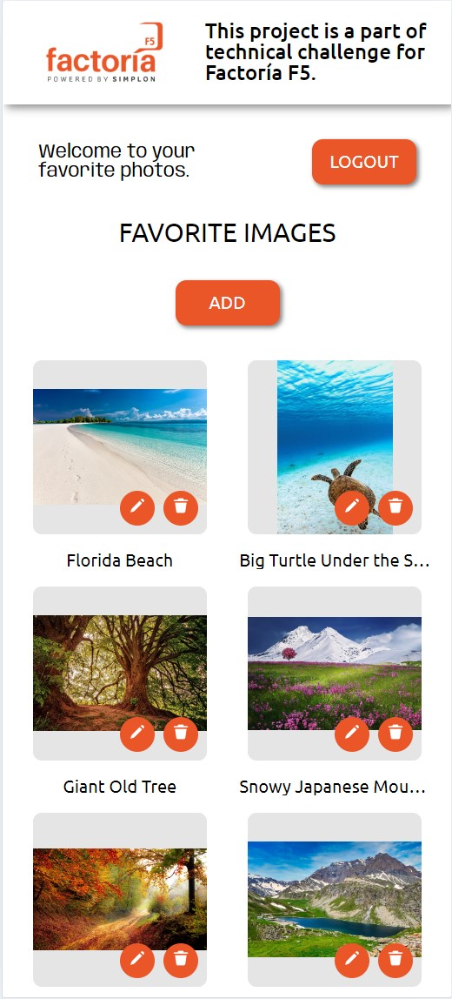
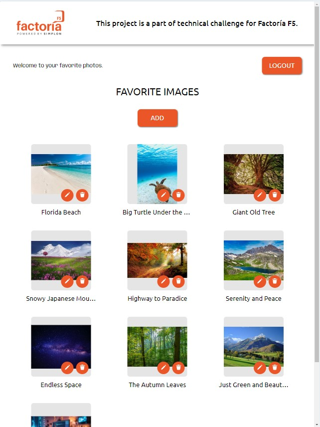
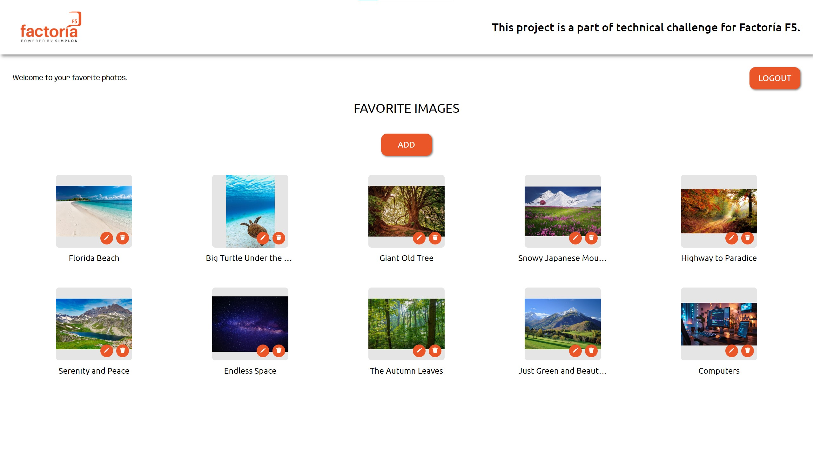

# Factoría F5 Technical Challenge Project

This is a project that was created by me as a technical challenge for Factoría F5.

## Description

This is an image manager project. You can register a user and login. After that a special section for your favorite images will appear. You will be able to add new images, edit them (change the image itself and its' title) and also delete them whenever you want. The images are linked only to your profile. The backend part of the application has protection so that nobody except you will not be able to see the photos, even the admin!

## Implemented frontend Features

- Login and logout
- User registration
- Complete CRUD of images

## Backend link

https://github.com/MarkWebDeveloper/Factoria-F5-Tech-Test-Backend

## Dependencies
[Vue.js](https://vuejs.org/) <br/>
[Pinia](https://pinia.vuejs.org/) <br/>
[Vue-router](https://router.vuejs.org/) <br/>
[Axios](https://axios-http.com/docs/intro)

## DevDependencies
[Sass](https://sass-lang.com/) <br/>
[Typescript](https://www.typescriptlang.org/) <br/>
[Vite](https://vitejs.dev/) <br/>
[Vitest](https://vitest.dev/)

## Screenshots

Mobile View <br/>



Tablet View <br/>



Desktop View <br/>



## Video Demonstration

Login process <br/>

<video controls src="public/images/videos/image-manager-login-demo.mp4" title="Title"></video>

Image Upload Process <br/>

<video controls src="public/images/videos/image-manager-post-demo.mp4" title="Title"></video>


## Recommended IDE Setup

[VSCode](https://code.visualstudio.com/) + [Volar](https://marketplace.visualstudio.com/items?itemName=Vue.volar) (and disable Vetur).

## Type Support for `.vue` Imports in TS

TypeScript cannot handle type information for `.vue` imports by default, so we replace the `tsc` CLI with `vue-tsc` for type checking. In editors, we need [Volar](https://marketplace.visualstudio.com/items?itemName=Vue.volar) to make the TypeScript language service aware of `.vue` types.

## Customize configuration

See [Vite Configuration Reference](https://vitejs.dev/config/).

## Project Setup

```sh
npm install
```

### Compile and Hot-Reload for Development

```sh
npm run dev
```

### Type-Check, Compile and Minify for Production

```sh
npm run build
```

### Run Unit Tests with [Vitest](https://vitest.dev/)

```sh
npm run test:unit
```
